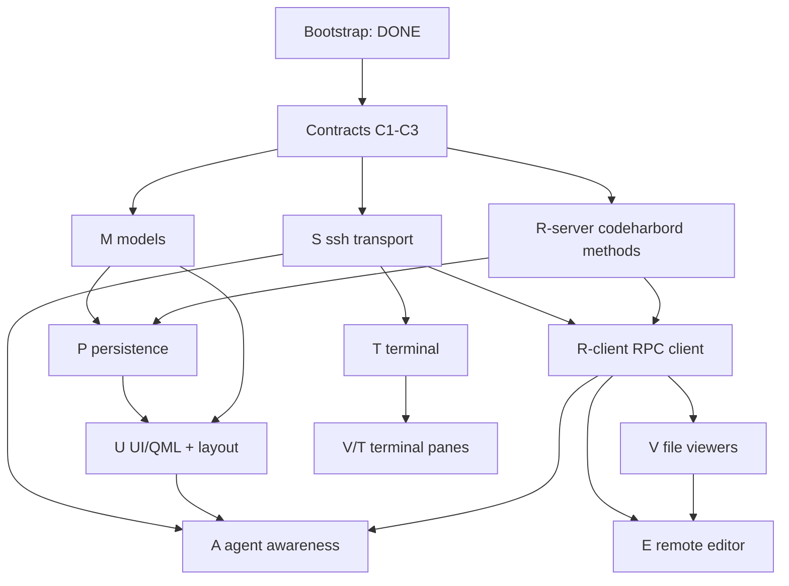

# CodeHarbor — Delivery Plan

Concrete, parallelizable workstreams with explicit **start gates** (preconditions)
and **stop gates** (verifiable done criteria). Each workstream exposes a small
contract so downstream work can build against it before it is fully implemented.

- Spec: [`SPEC.md`](SPEC.md)
- Workstream IDs (`M`, `P`, `S`, …) are referenced from source comments to link
  code back to this plan.

## How to use this plan

1. **Freeze contracts first** (§ Contracts). These are small, blocking, and owned
   centrally — do them before fanning out.
2. **Dispatch a wave.** A workstream may start once every box in its *Start gate*
   is checked. Workstreams in the same wave have no edges between them and run in
   parallel.
3. **Stop at the gate.** A workstream is *done* only when its *Stop gate* is
   verified by the stated command/scenario — not when it compiles.
4. **Milestones are barriers.** A milestone integrates several stop gates into a
   user-visible capability (mapped to SPEC §16 phases).

## Current state (bootstrap — DONE, verified)

- Repo initialized (`main`), license, ignore/attrs/editorconfig.
- Build wiring: top-level `CMakeLists.txt` + `CMakePresets.json`; per-module
  `ch_*` static libs; `src/qml` QML module; `codeharbor` executable; npm
  workspace root.
- C++/QML skeleton compiles-by-construction: `main.cpp` (WebEngine init + QML
  load), three-region `SplitView` layout, per-region placeholder panes.
- Model enums with real logic: `SessionState.{h,cpp}` (terminal/agent/row/file
  state + `aggregateRowState`), typed `Ids.h`.
- **Remote workspace fully implemented + tested (Node, zero deps):**
  - `events.ts` — internal event schema, validation, socket-path resolution.
  - `adapters/` — `oh-my-pi` (SPEC 6.5 mapping), `pi`, `claude-code`, registry.
  - `bridge.ts` — Unix-socket → JSONL relay (dir-create + stale-socket guard).
  - `codeharbord.ts` — JSON-RPC 2.0 `--stdio` dispatch (`ping`, `server.info`).
  - **Verified:** `npm test` → 11/11 pass; RPC stdio + bridge socket smoke-tested.
- CI: `remote` job (install/typecheck/test) and `client` job (Qt+CMake build).

> Everything below is **not yet built**. No stubs are presented as complete; the
> `throw new Error("not implemented")` seams in `src/web/*` and the thin `ch_*`
> libs are explicitly bootstrap placeholders scoped to the workstreams here.

## Contracts (freeze before fan-out)

These are the cross-workstream interfaces. Land them first; changing them later
is a coordinated break.

- [x] **C1 — RPC method catalog.** Extend `codeharbord.ts` with typed
  request/result shapes for the SPEC 10.2 methods (start with the file set:
  `stat`, `readFile`, `writeFile`, `watch`, `resolvePath`). Publish as
  `remote/src/rpc-types.ts`; mirror in C++ `src/remote/`. Owner: R.
- [x] **C2 — Workspace DB schema.** Author `remote/sql/schema.sql` for the SPEC
  11.1 tables (`groups`, `dev_sessions`, `viewer_panes`, `terminal_panes`,
  `session_layouts`, `server_profiles`, `server_settings`, `app_settings`) with
  `server_id` columns (SPEC 3.5). Bump `WorkspaceDb::kSchemaVersion`. Owner: P.
- [x] **C3 — WebChannel bridge interfaces.** Freeze the JS↔C++ object shapes:
  `TerminalBridge`/`TerminalHost` (`src/web/terminal`) and
  `RemoteEditorBridge`/`EditorHost` (`src/web/editor`). Owners: T, E.

**Status: LANDED** — delegated to three parallel subagents,
adversarially reviewed, and verified (remote typecheck + 15/15 tests; cmake
configure+build+link). Wave 1 (S / M / R-server) is now unblocked.

## Dependency graph

## Workstreams

### M — Core data model — ✅ LANDED (Wave 1)
- **Start gate:** [x] Bootstrap done · [x] C2 fields known.
- **TODO:**
  - [x] `Group`, `DevSession`, `ViewerPane`, `TerminalPane` value types + a
    `SplitNode` recursive split-tree type (SPEC 4.5), all under `src/models`.
  - [x] QAbstractItemModel adapter for the sidebar (`SessionsModel`).
  - [x] `aggregateRowState` wiring from per-terminal states.
- **Contract exposed:** header types other libs bind to (`WorkspaceTypes.h`,
  `SplitTree.h`, `SessionsModel.h`). QML registration deferred to U.
- **Stop gate:** [x] MET — `tst_models` (tree build, split round-trip,
  precedence) + `QAbstractItemModelTester`.

### P — Persistence — ✅ LANDED (Wave 2)
- **Start gate:** [x] C2 · [x] M types exist.
- **TODO:**
  - [x] `schema.sql` + migration runner (server-side, in codeharbord).
  - [x] CRUD for groups/sessions/panes/layouts; duplicate-session copy semantics
    (SPEC 4.2) generating fresh tmux targets + layout paneId remap.
  - [x] Client mapping in `ch_persistence` over RPC (no direct client DB access).
- **Contract exposed:** RPC methods `workspace.*` (list/create/update/reorder/…).
- **Stop gate:** [x] MET — `workspace.test.ts` create→reopen→reload identical;
  `tst_workspacedb` client parse/serialize + live round-trip.

### S — SSH transport — ✅ code complete (Wave 1); ⏳ live gate deferred
- **Start gate:** [x] Bootstrap · [x] libssh available (`libssh-dev`).
- **TODO:**
  - [x] `SshConnectionPool`: one authenticated connection, N channels (SPEC 5.3).
  - [x] Host-key verify + known-hosts store + changed-key/@revoked refusal (SPEC 12.1).
  - [x] Channel factory for PTY / RPC / agent-status channels.
  - [x] Credential handling via SSH agent → key → password callback (no secrets stored).
- **Contract exposed:** `openChannel(kind)`, host-key callback, state signals.
- **Stop gate:** ⏳ DEFERRED — the live SSH round-trip needs a test server (not
  available in CI here). Host-key logic covered by `tst_knownhosts`; the
  connect→verify→auth→openChannel path is implemented but unexercised live.
- **Parallel with:** M, R-server, P.

### R — Remote service + client — ✅ LANDED (R-server Wave 1, R-client Wave 2)
- **R-server (Node, codeharbord)**
  - **Start gate:** [x] Bootstrap · [x] C1 · [x] C2.
  - **TODO:** [x] file methods (`stat/readFile/writeFile/resolvePath`) with
    revision tokens (SPEC 8.4) + atomic save (SPEC 8.5); [x] `watch`/`unwatch`
    (fs.watch + poll fallback); [x] `listDirectory` (RPC, schema v2, for viewers)
    + `getMimeType` (internal helper); [x] `workspace.*` (with P). tmux: not yet.
  - **Stop gate:** [x] MET — `node --test` covers revision-mismatch rejection,
    atomic-save replace, watch-event emission.
- **R-client (C++ `ch_remote`)**
  - **Start gate:** [x] C1 · [x] S channel factory.
  - **TODO:** [x] JSONL framing over the RPC channel; [x] async request/response
    with typed results; [x] teardown/notification routing (reconnect scheduling TBD).
  - **Stop gate:** [x] MET — `tst_rpcclient` (framing, id-matching, errors,
    teardown) + live `server.info` over a piped codeharbord.

### T — Terminal — ✅ code complete (Wave 2); ⏳ live gate deferred
- **Start gate:** [x] S PTY channel · [x] C3.
- **TODO:**
  - [x] `TerminalController`: buffering (SPEC 5.5), state machine (SPEC 5.6),
    reconnect backoff, hidden-drain.
  - [x] tmux target naming with stable IDs (SPEC 5.2) + shell-safe command.
  - [x] xterm.js renderer in `src/web/terminal` + WebChannel bridge (C3).
  - [x] Recursive terminal-region split tree in QML.
- **Stop gate:** ⏳ DEFERRED — live attach/resize/reconnect needs a server +
  display. Controller logic covered by `tst_terminalcontroller`; kill/detach/
  reconnect wiring lands with the app shell (U).
- **Parallel with:** V, E (different regions).

### V — Viewers — ✅ code complete (Wave 3); ⏳ live-display gate deferred
- **Start gate:** [x] Bootstrap · [x] R-client (for `file://`).
- **TODO:**
  - [x] `ViewerHandlerRegistry` by scheme + extension (SPEC 7.5 table).
  - [x] Dual `QQuickWebEngineProfile`: external (no bridge) vs internal (SPEC 7.3), isolation asserted.
  - [x] `codeharbor-internal://` scheme handler + bidirectional URL map (SPEC 7.4), served via file.readFile.
  - [x] Views: web, source/text, markdown, structured-data, image, PDF,
    directory, binary; recursive viewer-region split tree in QML.
- **Stop gate:** ✅ testable parts MET — `tst_viewers` covers the SPEC 7.5 table,
  URL round-trip, MIME, and profile isolation (external no-scheme / internal
  privileged, M3). ⏳ The live "HTTPS + text + image + directory in split panes"
  render needs a display + server; wired but unexercised headless.
- **Parallel with:** T.

### E — Remote editor — ✅ core landed (Wave 4); ⏳ live editor gate deferred
- **Start gate:** [x] R file methods (stat/read/write/watch) · [x] V pane host · [x] C3.
- **TODO:**
  - [x] Monaco bundle + WebChannel-native `EditorBridge` (C3, object "editor") in `src/web/editor`.
  - [x] File-state machine (SPEC 8.2), revision-guarded save + conflict (SPEC 8.6 — never silent overwrite), external-change reload for clean buffers / no-clobber when dirty.
  - [x] Unsaved recovery snapshots on the server (SPEC 11.3) via revision-guarded writeFile; per-pane EditorController (EditorFactory) with watch released on close.
- **Stop gate:** ✅ testable core MET — `tst_editorcontroller` covers load→Clean,
  revision-guarded save, conflict (no overwrite), external reload vs dirty
  no-clobber, recovery snapshot+offer, and watch-unsubscribe on close/reopen.
  ⏳ Live editing deferred to a display + packaged Monaco bundle; refinements: a
  JS→C++ ready handshake (content can be missed before the page connects) and
  clearing the recovery snapshot on a successful save.
- **Parallel with:** T.

### A — Agent awareness — ✅ core landed (Wave 4); ⏳ live sidebar/notify deferred
- **Start gate:** [x] bridge+adapters DONE · [x] S agent channel (ChannelKind::AgentStatus) · [x] U sidebar.
- **TODO:**
  - [x] `AgentStatusMonitor` (C++) consuming AgentEvent JSONL over the agent channel.
  - [x] Map `AgentState` → sidebar row precedence + unseen-completion; markSeen clears the badge; notify() hook on waiting_input/idle_unseen (OS notification display-deferred).
  - [x] `oh-my-pi` installable hook emitting BridgeMessage through the bridge (single mapping point); `pi`/`claude-code` adapters already registered server-side.
  - [x] Fallback coarse activity detection (SPEC 6.6) for the adapterless `generic` harness.
- **Stop gate:** ✅ testable core MET — `tst_agentmonitor` (parse/framing/state/unseen/markSeen),
  the hook→bridge→AgentEvent end-to-end test, and `tst_appcontroller` (live agent state
  merged into the sidebar, not wiped by refresh). ⏳ The live "run Oh My Pi → sidebar
  reacts" gate needs a display + a running agent channel.
- **Parallel with:** V, E (after U).

### U — UI shell & persistence — ✅ core landed (Wave 3); ⏳ live restart gate deferred
- **Start gate:** [x] M models · [x] P (for layout persistence).
- **TODO:**
  - [x] Sidebar: groups (collapse), session rows with aggregate status, ops
    create/rename/duplicate/move/delete (SPEC 4.2). Drag-reorder: invokables ready, DnD UI TBD.
  - [x] Persist region widths + selected pane per client (QSettings, SPEC 4.1); split ratios persist server-side via P layouts.
  - [ ] Command palette + keyboard shortcuts (SPEC 15).
- **Stop gate:** ✅ testable parts MET — `tst_appcontroller` covers GroupNode→row
  mapping + UiStateStore persistence across a fresh instance ("restart"). ⏳ Live
  CRUD against a running server + width-restore on app relaunch needs display + server.
- **Parallel with:** V/T rendering (consumes their pane views).

## Milestones (integration barriers → SPEC §16)

- **M0 — Bootstrap (DONE).** Repo, build wiring, remote core tested.
- **M1 — Terminal vertical slice (SPEC Phase 0).** ⏳ Code complete (S + T + U shell);
  the live stop gate (attach/resize/reconnect) needs a test SSH server + display.
  Transport + controller unit-tested.
- **M2 — Core workspace (SPEC Phase 1).** ✅ Landed: M + P + R-client + U (sidebar,
  CRUD, persistence). Live multi-terminal render + relaunch-restore deferred to a
  display/server; logic unit-tested (`tst_appcontroller`).
- **M3 — Remote viewers (SPEC Phase 2).** ✅ Landed: V handler registry + dual-profile
  isolation + internal scheme + viewer split-tree. Live split-pane render deferred
  to a display/server; registry/URL/MIME/isolation unit-tested (`tst_viewers`).
- **M4 — Remote editing (SPEC Phase 3).** ✅ Landed: E editor state machine +
  revision-guarded save/conflict + external reload + recovery snapshots + Monaco
  bridge. Live in-pane editing deferred to a display + packaged bundle; core
  unit-tested (`tst_editorcontroller`).
- **M5 — Agent awareness (SPEC Phase 4).** ✅ Landed: A monitor + state/unseen
  mapping + oh-my-pi hook + fallback; agent state merged into the sidebar. Live
  agent-driven sidebar deferred to a display/agent channel; core unit-tested
  (`tst_agentmonitor`, `tst_appcontroller`).

## Delivery progress

**Wave 0 — contracts: ✅ DONE.** C1/C2/C3 landed + adversarially reviewed.

**Wave 1 — ✅ DONE** (S, M, R-server) + parallel adversarial review + bug-hunt. Live S gate deferred.

**Wave 2 — ✅ DONE** (P server+client, R-client, T) + adversarial-review wave. Live T gate deferred.

**Wave 3 — ✅ DONE** (U shell, V viewers) → milestones **M2** and **M3** reached
(logic verified; live display/server render gates deferred). Delivered with a
concurrent Wave-2 bug-hunt (R-client null-error HIGH, P schema_version latent) and
a Wave-3 adversarial review (U callback use-after-free + silent-no-op sidebar HIGHs,
V profile-type M3 blocker). Contract C1 gained `file.listDirectory` (schema v2).

**Wave 4 — ✅ DONE** (E editor, A agent) → milestones **M4** and **M5** reached
(logic verified; live editor / agent-sidebar render deferred). Delivered with a
concurrent Wave-3 bug-hunt (U setServerId + stale-refresh ordering; V nosniff +
active-MIME gate) and a Wave-4 adversarial review (E watch-subscription leak +
read-only save; A markSeen badge-clear + version fidelity + transport UAF).
Contract: the oh-my-pi hook emits BridgeMessage (the bridge stays the single mapping point).

> All five feature milestones (M1–M5) are code-complete. Remaining work is almost
> entirely LIVE gates — S/T attach, U/V/E in-pane render, live agent-driven
> sidebar — each wired + unit-tested, needing a reachable SSH server + a display.
> Two E code refinements also remain: a JS→C++ ready handshake (content can be
> missed before the page connects) and clearing the recovery snapshot on a
> successful save.
