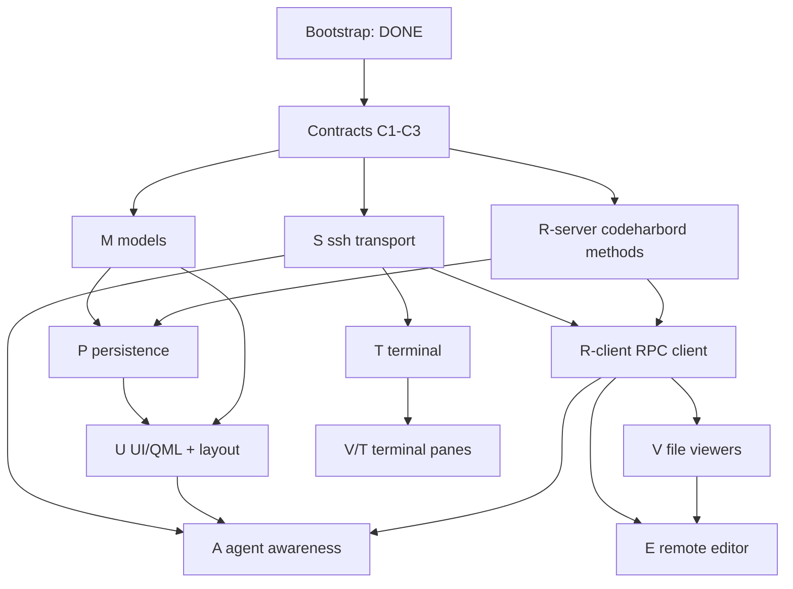

# CodeHarbor — Delivery Plan

Concrete, parallelizable workstreams with explicit **start gates** (preconditions)
and **stop gates** (verifiable done criteria). Each workstream exposes a small
contract so downstream work can build against it before it is fully implemented.

- Spec: [`SPEC.md`](SPEC.md)
- Workstream IDs (`M`, `P`, `S`, …) are referenced from source comments to link
  code back to this plan.

## How to use this plan

1. **Freeze contracts first** (§ Contracts). These are small, blocking, and owned
   centrally — do them before fanning out.
2. **Dispatch a wave.** A workstream may start once every box in its *Start gate*
   is checked. Workstreams in the same wave have no edges between them and run in
   parallel.
3. **Stop at the gate.** A workstream is *done* only when its *Stop gate* is
   verified by the stated command/scenario — not when it compiles.
4. **Milestones are barriers.** A milestone integrates several stop gates into a
   user-visible capability (mapped to SPEC §16 phases).

## Current state (bootstrap — DONE, verified)

- Repo initialized (`main`), license, ignore/attrs/editorconfig.
- Build wiring: top-level `CMakeLists.txt` + `CMakePresets.json`; per-module
  `ch_*` static libs; `src/qml` QML module; `codeharbor` executable; npm
  workspace root.
- C++/QML skeleton compiles-by-construction: `main.cpp` (WebEngine init + QML
  load), three-region `SplitView` layout, per-region placeholder panes.
- Model enums with real logic: `SessionState.{h,cpp}` (terminal/agent/row/file
  state + `aggregateRowState`), typed `Ids.h`.
- **Remote workspace fully implemented + tested (Node, zero deps):**
  - `events.ts` — internal event schema, validation, socket-path resolution.
  - `adapters/` — `oh-my-pi` (SPEC 6.5 mapping), `pi`, `claude-code`, registry.
  - `bridge.ts` — Unix-socket → JSONL relay (dir-create + stale-socket guard).
  - `codeharbord.ts` — JSON-RPC 2.0 `--stdio` dispatch (`ping`, `server.info`).
  - **Verified:** `npm test` → 11/11 pass; RPC stdio + bridge socket smoke-tested.
- CI: `remote` job (install/typecheck/test) and `client` job (Qt+CMake build).

> The bootstrap seams described above are all filled in by later waves; see
> "Delivery progress" for what actually landed and the corrections found when the
> live gates were first exercised.

## Contracts (freeze before fan-out)

These are the cross-workstream interfaces. Land them first; changing them later
is a coordinated break.

- [x] **C1 — RPC method catalog.** Extend `codeharbord.ts` with typed
  request/result shapes for the SPEC 10.2 methods (start with the file set:
  `stat`, `readFile`, `writeFile`, `watch`, `resolvePath`). Publish as
  `remote/src/rpc-types.ts`; mirror in C++ `src/remote/`. Owner: R.
- [x] **C2 — Workspace DB schema.** Author `remote/sql/schema.sql` for the SPEC
  11.1 tables (`groups`, `dev_sessions`, `viewer_panes`, `terminal_panes`,
  `session_layouts`, `server_profiles`, `server_settings`, `app_settings`) with
  `server_id` columns (SPEC 3.5). Bump `WorkspaceDb::kSchemaVersion`. Owner: P.
- [x] **C3 — WebChannel bridge interfaces.** Freeze the JS↔C++ object shapes:
  `TerminalBridge`/`TerminalHost` (`src/web/terminal`) and
  `RemoteEditorBridge`/`EditorHost` (`src/web/editor`). Owners: T, E.

**Status: LANDED** — delegated to three parallel subagents,
adversarially reviewed, and verified (remote typecheck + 15/15 tests; cmake
configure+build+link). Wave 1 (S / M / R-server) is now unblocked.

## Dependency graph

## Workstreams

### M — Core data model — ✅ LANDED (Wave 1)
- **Start gate:** [x] Bootstrap done · [x] C2 fields known.
- **TODO:**
  - [x] `Group`, `DevSession`, `ViewerPane`, `TerminalPane` value types + a
    `SplitNode` recursive split-tree type (SPEC 4.5), all under `src/models`.
  - [x] QAbstractItemModel adapter for the sidebar (`SessionsModel`).
  - [x] `aggregateRowState` wiring from per-terminal states.
- **Contract exposed:** header types other libs bind to (`WorkspaceTypes.h`,
  `SplitTree.h`, `SessionsModel.h`). QML registration deferred to U.
- **Stop gate:** [x] MET — `tst_models` (tree build, split round-trip,
  precedence) + `QAbstractItemModelTester`.

### P — Persistence — ✅ LANDED (Wave 2)
- **Start gate:** [x] C2 · [x] M types exist.
- **TODO:**
  - [x] `schema.sql` + migration runner (server-side, in codeharbord).
  - [x] CRUD for groups/sessions/panes/layouts; duplicate-session copy semantics
    (SPEC 4.2) generating fresh tmux targets + layout paneId remap.
  - [x] Client mapping in `ch_persistence` over RPC (no direct client DB access).
- **Contract exposed:** RPC methods `workspace.*` (list/create/update/reorder/…).
- **Stop gate:** [x] MET — `workspace.test.ts` create→reopen→reload identical;
  `tst_workspacedb` client parse/serialize + live round-trip.

### S — SSH transport — ✅ LANDED (Wave 1); live gate MET (Wave 5)
- **Start gate:** [x] Bootstrap · [x] libssh available (`libssh-dev`).
- **TODO:**
  - [x] `SshConnectionPool`: one authenticated connection, N channels (SPEC 5.3).
  - [x] Host-key verify + known-hosts store + changed-key/@revoked refusal (SPEC 12.1).
  - [x] Channel factory for PTY / RPC / agent-status channels.
  - [x] Credential handling via SSH agent → key → password callback (no secrets stored).
- **Contract exposed:** `openChannel(kind)`, host-key callback, state signals.
- **Stop gate:** ✅ MET — `tst_livessh` (label `live`) connects to a real sshd via
  ssh-agent auth, persists the first-use host key, runs an Exec channel, and drives
  JSON-RPC to a real `codeharbord` over an SSH channel; `tst_knownhosts` covers the
  host-key/@revoked logic. Reconnect scheduling on the RPC channel is still TBD.
- **Parallel with:** M, R-server, P.

### R — Remote service + client — ✅ LANDED (R-server Wave 1, R-client Wave 2)
- **R-server (Node, codeharbord)**
  - **Start gate:** [x] Bootstrap · [x] C1 · [x] C2.
  - **TODO:** [x] file methods (`stat/readFile/writeFile/resolvePath`) with
    revision tokens (SPEC 8.4) + atomic save (SPEC 8.5); [x] `watch`/`unwatch`
    (fs.watch + poll fallback); [x] `listDirectory` (RPC, schema v2, for viewers)
    + `getMimeType` (internal helper); [x] `workspace.*` (with P). tmux: not yet.
  - **Stop gate:** [x] MET — `node --test` covers revision-mismatch rejection,
    atomic-save replace, watch-event emission.
- **R-client (C++ `ch_remote`)**
  - **Start gate:** [x] C1 · [x] S channel factory.
  - **TODO:** [x] JSONL framing over the RPC channel; [x] async request/response
    with typed results; [x] teardown/notification routing; [x] reconnect
    scheduling (`SessionBootstrap` state machine + 1/2/5/10/30/60 s backoff,
    capped at 10 attempts; SPEC 5.6).
  - **Stop gate:** [x] MET — `tst_rpcclient` (framing, id-matching, errors,
    teardown) + live `server.info` over a piped codeharbord +
    `tst_sessionbootstrap` / live `tst_livereconnect` (a real dropped SSH
    connection recovers on its own).

### T — Terminal — ✅ LANDED (Wave 2); live gate MET (Wave 5)
- **Start gate:** [x] S PTY channel · [x] C3.
- **TODO:**
  - [x] `TerminalController`: buffering (SPEC 5.5), state machine (SPEC 5.6),
    reconnect backoff, hidden-drain.
  - [x] tmux target naming with stable IDs (SPEC 5.2) + shell-safe command.
  - [x] xterm.js renderer in `src/web/terminal` + WebChannel bridge (C3).
  - [x] Recursive terminal-region split tree in QML.
- **Stop gate:** ✅ MET — `tst_liveterminal` attaches to a real tmux session over a
  real SSH PTY, and the remote side confirms each step: the marker is produced by
  remote execution, `tmux display-message` reports 80x24 → 100x30 after
  `TerminalController::resize`, and after dropping the channel a fresh PTY re-attach
  finds the same pane (identical shell pid, scrollback intact). Controller logic is
  covered by `tst_terminalcontroller`. Wave 5 added the missing production seam:
  `TerminalController::setTransport(QIODevice*)`, with resize reaching
  `SshChannelDevice::resizePty`. Kill/detach UI still lands with U.
- **Parallel with:** V, E (different regions).

### V — Viewers — ✅ LANDED (Wave 3); live gate MET (Wave 5)
- **Start gate:** [x] Bootstrap · [x] R-client (for `file://`).
- **TODO:**
  - [x] `ViewerHandlerRegistry` by scheme + extension (SPEC 7.5 table).
  - [x] Dual `QQuickWebEngineProfile`: external (no bridge) vs internal (SPEC 7.3), isolation asserted.
  - [x] `codeharbor-internal://` scheme handler + bidirectional URL map (SPEC 7.4), served via file.readFile.
  - [x] Views: web, source/text, markdown, structured-data, image, PDF,
    directory, binary; recursive viewer-region split tree in QML.
- **Stop gate:** ✅ MET — `tst_liveviewers` loads real remote file bytes through
  `codeharbor-internal://` into a WebEngineView headless and reads them back out of
  the page via `runJavaScript`; live `file.listDirectory` populates a directory view
  per pane; the split tree is measured in 6 cases (even, 3-way, explicit ratios,
  pane added after first layout) with extents summing to the parent within 1px; and
  `grabWindow()` frame proofs are saved as PNGs. `tst_viewers` still covers the
  SPEC 7.5 table, URL round-trip, MIME and profile isolation.
  Wave 5 fixed a real defect this gate exposed: every branch child set
  `SplitView.fillWidth/fillHeight`, but SplitView stretches only the FIRST fill
  item, so a 2-pane split rendered as one full pane plus a zero-extent sibling.
  Splits now size from the node's persisted `ratios`.
- **Parallel with:** T.

### E — Remote editor — ✅ LANDED (Wave 4); live gate MET (Wave 5)
- **Start gate:** [x] R file methods (stat/read/write/watch) · [x] V pane host · [x] C3.
- **TODO:**
  - [x] Monaco bundle + WebChannel-native `EditorBridge` (C3, object "editor") in `src/web/editor`.
  - [x] File-state machine (SPEC 8.2), revision-guarded save + conflict (SPEC 8.6 — never silent overwrite), external-change reload for clean buffers / no-clobber when dirty.
  - [x] Unsaved recovery snapshots on the server (SPEC 11.3) via revision-guarded writeFile; per-pane EditorController (EditorFactory) with watch released on close.
- **Stop gate:** ✅ MET — `tst_liveeditor` drives the real packaged Monaco page in
  the real `EditorPaneView` over a real SSH connection: the load assertion is read
  from INSIDE the page (`monaco.editor.getModels()[0].getValue()`), the edit is made
  with Monaco's own type command, a real DOM Ctrl+S triggers the revision-guarded
  save, and the REMOTE DISK bytes are re-read out of band to confirm it landed.
  SPEC 8.6 is proven live: an external change makes the stale-revision save conflict,
  the doomed edit is absent from disk, and the page's own Reload path then adopts the
  server revision so the next save succeeds. `tst_editorcontroller` covers the state
  machine. Both previously-deferred refinements are DONE: the JS→C++ `ready()`
  handshake (content pushed before the page connects is buffered and replayed) and
  clearing the recovery snapshot on a successful save. The Monaco bundle is now
  really packaged (esbuild → qrc), built automatically at configure time.
- **Parallel with:** T.

### A — Agent awareness — ✅ LANDED (Wave 4); live gate MET (Wave 5)
- **Start gate:** [x] bridge+adapters DONE · [x] S agent channel (ChannelKind::AgentStatus) · [x] U sidebar.
- **TODO:**
  - [x] `AgentStatusMonitor` (C++) consuming AgentEvent JSONL over the agent channel.
  - [x] Map `AgentState` → sidebar row precedence + unseen-completion; markSeen clears the badge; notify() hook on waiting_input/idle_unseen (OS notification display-deferred).
  - [x] `oh-my-pi` installable hook emitting BridgeMessage through the bridge (single mapping point); `pi`/`claude-code` adapters already registered server-side.
  - [x] Fallback coarse activity detection (SPEC 6.6) for the adapterless `generic` harness.
- **Stop gate:** ✅ MET — `tst_liveagent` runs the REAL hook on the remote side
  (one node process per firing) into the REAL bridge, over an SSH AgentStatus
  channel, and observes the ordered transitions
  `starting → running → waiting_input → running → idle_unseen`, with the summary
  surviving the whole chain, `markSeen` clearing the badge idempotently, and the
  sidebar row going FinishedUnseen → Idle. Remote bridge pids are asserted reaped
  (an SSH exec channel sends no SIGHUP). OS desktop notifications remain
  display-deferred: `notify()` fires and is asserted, but nothing renders headless.
- **Parallel with:** V, E (after U).

### U — UI shell & persistence — ✅ LANDED (Wave 3); live gate MET (Wave 5)
- **Start gate:** [x] M models · [x] P (for layout persistence).
- **TODO:**
  - [x] Sidebar: groups (collapse), session rows with aggregate status, ops
    create/rename/duplicate/move/delete (SPEC 4.2). Drag-reorder: invokables ready, DnD UI TBD.
  - [x] Persist region widths + selected pane per client (QSettings, SPEC 4.1); split ratios persist server-side via P layouts.
  - [ ] Command palette + keyboard shortcuts (SPEC 15).
- **Stop gate:** ✅ MET — `tst_liveshell` performs live CRUD through AppController's
  invokables against a real `codeharbord`, then re-reads every mutation through a
  SECOND independent codeharbord process (so a local-only mutation fails), and
  proves width persistence three ways: the real `Main.qml` restores stored widths
  in-process, a real-binary launch does NOT rewrite them (even when the window is
  too narrow to honour them), and a real handle drag DOES persist to disk.
  Wave 5 fixed a defect this gate exposed: persistence fired on every width change,
  so a restored width that did not fit was clamped and the clamped value overwrote
  the user's preference permanently. Writes now happen only on drag end.
  Command palette + shortcuts (SPEC 15) remain unimplemented.
- **Parallel with:** V/T rendering (consumes their pane views).

## Milestones (integration barriers → SPEC §16)

- **M0 — Bootstrap (DONE).** Repo, build wiring, remote core tested.
- **M1 — Terminal vertical slice (SPEC Phase 0).** ✅ REACHED (live, Wave 5) — real
  SSH attach to a real tmux session, remote-confirmed resize, and reconnect onto the
  same pane (`tst_livessh`, `tst_liveterminal`).
- **M2 — Core workspace (SPEC Phase 1).** ✅ REACHED (live, Wave 5) — live CRUD
  against a real `codeharbord`, verified through a second independent server process,
  plus width restore and drag-persistence (`tst_liveshell`).
- **M3 — Remote viewers (SPEC Phase 2).** ✅ REACHED (live, Wave 5) — real remote
  bytes rendered through `codeharbor-internal://`, live directory listings, measured
  split geometry, frame proofs (`tst_liveviewers`).
- **M4 — Remote editing (SPEC Phase 3).** ✅ REACHED (live, Wave 5) — real Monaco
  editing a real remote file over SSH, save landing on remote disk, live conflict
  refusal + reload (`tst_liveeditor`).
- **M5 — Agent awareness (SPEC Phase 4).** ✅ REACHED (live, Wave 5) — the real hook
  on the remote side driving ordered sidebar transitions and badge clearing
  (`tst_liveagent`). OS desktop notifications remain display-deferred.

## Delivery progress

**Wave 0 — contracts: ✅ DONE.** C1/C2/C3 landed + adversarially reviewed.

**Wave 1 — ✅ DONE** (S, M, R-server) + parallel adversarial review + bug-hunt. Live S gate deferred.

**Wave 2 — ✅ DONE** (P server+client, R-client, T) + adversarial-review wave. Live T gate deferred.

**Wave 3 — ✅ DONE** (U shell, V viewers) → milestones **M2** and **M3** reached
(logic verified; live display/server render gates deferred). Delivered with a
concurrent Wave-2 bug-hunt (R-client null-error HIGH, P schema_version latent) and
a Wave-3 adversarial review (U callback use-after-free + silent-no-op sidebar HIGHs,
V profile-type M3 blocker). Contract C1 gained `file.listDirectory` (schema v2).

**Wave 4 — ✅ DONE** (E editor, A agent) → milestones **M4** and **M5** reached
(logic verified; live editor / agent-sidebar render deferred). Delivered with a
concurrent Wave-3 bug-hunt (U setServerId + stale-refresh ordering; V nosniff +
active-MIME gate) and a Wave-4 adversarial review (E watch-subscription leak +
read-only save; A markSeen badge-clear + version fidelity + transport UAF).
Contract: the oh-my-pi hook emits BridgeMessage (the bridge stays the single mapping point).

> **Corrections (each found only when something real was exercised).** Three
> times now a green suite has coexisted with a product that did not work. Each
> entry is here because the suite said "fine" and the truth was otherwise.
>
> 1. **No transport spine** (Wave 5). `CodeharbordClient::setTransport` and
>    `AgentStatusMonitor::setTransport` existed and were unit-tested, but there was
>    no `QIODevice` over an `ssh_channel` and `main.cpp` never called either. The
>    shipped app could not reach a remote server at all — the client subsystems
>    were only ever driven by test doubles. Fixed by `SshChannelDevice` +
>    `SessionBootstrap`.
> 2. **The app could not start** (Wave 5). `ViewerRegion.qml`/`TerminalRegion.qml`
>    instantiated their own type recursively, which QML rejects, so `Main.qml`
>    failed to load. No test instantiated the real QML tree, so a green 9/9 suite
>    coexisted with an app that could not launch. Fixed by url-sourced `Loader`
>    recursion plus a permanent `tst_qmlload` gate.
> 3. **Unknown SSH host keys were trusted silently** (Wave 7, SECURITY).
>    `SessionBootstrap::attemptWire` unconditionally installed an accept-all
>    host-key callback, overwriting the prompting callback `AppController` had
>    just installed. Every unknown key was therefore accepted and written to
>    `known_hosts` with no consent, and the entire host-key prompt UI —
>    `hostKeyPrompt`, `resolveHostKey`, the ConnectSheet fingerprint view — was
>    dead code. This deviates from SPEC 12.1, and it is the sharpest example of
>    the pattern: the Wave-5 and Wave-6 cold-start walkthroughs "succeeded"
>    PARTLY BECAUSE of this bug, since nothing ever had to answer a prompt. Fixed
>    by installing the accept-all default only when no policy is set
>    (headless/unattended use), and now defended end to end by `tst_coldstart`.
>
> Treat "code complete" as "unit-tested logic" unless a workstream's live gate is
> explicitly marked MET — and treat a gate that has never failed with suspicion
> until you have watched it fail.

**Wave 5 — ✅ DONE (live gates).** Every deferred live gate is now MET against a real
sshd + real `codeharbord`: S, T, U, V, E, A (`tst_livessh`, `tst_liveterminal`,
`tst_liveshell`, `tst_liveviewers`, `tst_liveeditor`, `tst_liveagent`, all labelled
`live` and QSKIPped when `CH_LIVE_SSH` is unset, so the default suite stays portable).
Milestones M1–M5 are reached LIVE, not just unit-tested.

Wave 5 built the missing production spine (`SshChannelDevice` — a `QIODevice` over an
`ssh_channel`; `SessionBootstrap` wiring RPC + agent channels in `main.cpp`;
`TerminalController::setTransport`) and packaged the real Monaco bundle (esbuild → qrc,
auto-built at configure time, with CMake refusing to configure a silently editor-less
client). Defects the live gates exposed — none of which the headless suite could see:

- **QML could not load at all** — recursive self-instantiation in both region types.
- **Zero-extent split panes** — `SplitView` stretches only the first fill item, so a
  2-pane split showed one pane plus an invisible sibling.
- **Region widths destroyed on launch** — persistence fired on clamped layout changes,
  overwriting the user's stored preference permanently.
- **Non-deterministic sidebar ordering** — `moveSessionToGroup` left rows tied on
  `position`, so `ORDER BY position, id` fell back to UUID order.
- **Orphaned remote process per launch** — an SSH exec channel sends no SIGHUP, so the
  agent bridge outlived the app.
- **Fatal Chromium flag** — `--single-process` aborts once a second `QWebEngineProfile`
  exists, which the viewer stack creates by design.

**Wave 6 — ✅ DONE (usability).** The live gates passed but a person still could not
use the app: nothing could reach a server, selecting a session did nothing, and there
was no terminal in the UI at all. Wave 6 added stored connection profiles + a connect
/host-key sheet, a real packaged xterm.js bundle with a per-pane `TerminalFactory`
(live remote shells in panes), `SessionLayouts` (a session's split trees load from and
persist to the server), sidebar drag-and-drop, the SPEC 15 command palette with global
shortcuts, reconnect with the SPEC 5.6 backoff ladder, OS notifications, and `tmux.*`
discovery RPC. The workspace is now keyed by a SERVER-OWNED id (`server.info.serverId`,
persisted in `server_identity`) — a client-local id would have orphaned the user's real
groups and sessions whenever a profile was re-added or a second machine connected.

**Wave 7 — ⚠️ PARTIALLY COMPLETED (adversarial round).** Be precise about this one: the
eight-reviewer wave was **cut short by a harness limit and every reviewer was killed
mid-flight**. Their code changes were already on disk, so the round was salvaged by
re-dispatching finishers scoped to the failing tests each had left behind, and by the
orchestrator finishing the rest. What that means:

- **Swept and completed:** the cold-start acceptance gate (`tst_coldstart`, 9/9 —
  first run → add server → key prompt/accept/persist → session → live tmux pane →
  edit+save a remote file → relaunch restores), pane identity across splits, the UI/UX
  pass, and a verification pass over the interrupted fixes.
- **Salvaged, NOT completed:** the security and integration reviews. Their FIXES
  landed and are tested, but each reviewer died before writing its findings list, so
  any defect it had noticed and not yet written down was lost with it. The host-key
  hole below survived only because that reviewer happened to report it over IRC first.
  **A fresh security review is still owed** — treat Wave 7 as evidence that the
  reviewed areas contain bugs, not as evidence that they are now clean.

Defects Wave 7 found and fixed: unknown SSH host keys silently trusted (see correction
3 — security); splitting a region **destroyed the pane the user was working in**, and a
republished tree rebuilt every delegate because the Repeater was keyed on the children
array; `file.watch` was never re-established after a reconnect, so external-change
reload silently died for every open editor; deliberate teardown and the deliberate
host-key refusal were painted as red error toasts; three "fixed" items were green only
because no test exercised the path at all.

> Remaining known gaps: a fresh security review (see above); pane focus is not tracked,
> so palette split commands act on a region's first pane rather than the focused one;
> drag-adjusted split ratios persist but pane FOCUS/selection does not; `tmux.*`
> discovery is server-side only and no client code consumes it yet; connect is a
> synchronous libssh handshake on the GUI thread (bounded by a timeout, but it briefly
> blocks the UI — moving the session to a worker thread is the real fix).
