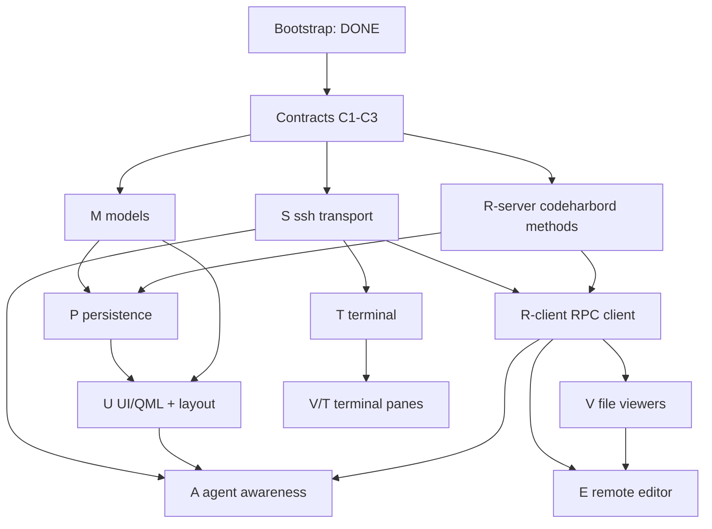

# CodeHarbor — Delivery Plan

Concrete, parallelizable workstreams with explicit **start gates** (preconditions)
and **stop gates** (verifiable done criteria). Each workstream exposes a small
contract so downstream work can build against it before it is fully implemented.

- Spec: [`SPEC.md`](SPEC.md)
- Workstream IDs (`M`, `P`, `S`, …) are referenced from source comments to link
  code back to this plan.

## How to use this plan

1. **Freeze contracts first** (§ Contracts). These are small, blocking, and owned
   centrally — do them before fanning out.
2. **Dispatch a wave.** A workstream may start once every box in its *Start gate*
   is checked. Workstreams in the same wave have no edges between them and run in
   parallel.
3. **Stop at the gate.** A workstream is *done* only when its *Stop gate* is
   verified by the stated command/scenario — not when it compiles.
4. **Milestones are barriers.** A milestone integrates several stop gates into a
   user-visible capability (mapped to SPEC §16 phases).

## Current state (bootstrap — DONE, verified)

- Repo initialized (`main`), license, ignore/attrs/editorconfig.
- Build wiring: top-level `CMakeLists.txt` + `CMakePresets.json`; per-module
  `ch_*` static libs; `src/qml` QML module; `codeharbor` executable; npm
  workspace root.
- C++/QML skeleton compiles-by-construction: `main.cpp` (WebEngine init + QML
  load), three-region `SplitView` layout, per-region placeholder panes.
- Model enums with real logic: `SessionState.{h,cpp}` (terminal/agent/row/file
  state + `aggregateRowState`), typed `Ids.h`.
- **Remote workspace fully implemented + tested (Node, zero deps):**
  - `events.ts` — internal event schema, validation, socket-path resolution.
  - `adapters/` — `oh-my-pi` (SPEC 6.5 mapping), `pi`, `claude-code`, registry.
  - `bridge.ts` — Unix-socket → JSONL relay (dir-create + stale-socket guard).
  - `codeharbord.ts` — JSON-RPC 2.0 `--stdio` dispatch (`ping`, `server.info`).
  - **Verified:** `npm test` → 11/11 pass; RPC stdio + bridge socket smoke-tested.
- CI: `remote` job (install/typecheck/test) and `client` job (Qt+CMake build).

> Everything below is **not yet built**. No stubs are presented as complete; the
> `throw new Error("not implemented")` seams in `src/web/*` and the thin `ch_*`
> libs are explicitly bootstrap placeholders scoped to the workstreams here.

## Contracts (freeze before fan-out)

These are the cross-workstream interfaces. Land them first; changing them later
is a coordinated break.

- [x] **C1 — RPC method catalog.** Extend `codeharbord.ts` with typed
  request/result shapes for the SPEC 10.2 methods (start with the file set:
  `stat`, `readFile`, `writeFile`, `watch`, `resolvePath`). Publish as
  `remote/src/rpc-types.ts`; mirror in C++ `src/remote/`. Owner: R.
- [x] **C2 — Workspace DB schema.** Author `remote/sql/schema.sql` for the SPEC
  11.1 tables (`groups`, `dev_sessions`, `viewer_panes`, `terminal_panes`,
  `session_layouts`, `server_profiles`, `server_settings`, `app_settings`) with
  `server_id` columns (SPEC 3.5). Bump `WorkspaceDb::kSchemaVersion`. Owner: P.
- [x] **C3 — WebChannel bridge interfaces.** Freeze the JS↔C++ object shapes:
  `TerminalBridge`/`TerminalHost` (`src/web/terminal`) and
  `RemoteEditorBridge`/`EditorHost` (`src/web/editor`). Owners: T, E.

**Status: LANDED** — delegated to three parallel subagents,
adversarially reviewed, and verified (remote typecheck + 15/15 tests; cmake
configure+build+link). Wave 1 (S / M / R-server) is now unblocked.

## Dependency graph

## Workstreams

### M — Core data model
- **Start gate:** [x] Bootstrap done · [ ] C2 fields known.
- **TODO:**
  - [ ] `Group`, `DevSession`, `ViewerPane`, `TerminalPane` value types + a
    `SplitNode` recursive split-tree type (SPEC 4.5), all under `src/models`.
  - [ ] QAbstractItemModel adapters for the sidebar and split trees.
  - [ ] `aggregateRowState` wiring from per-terminal states (already unit-shaped).
- **Contract exposed:** header types other libs bind to; QML-registered models.
- **Stop gate:** a C++ unit test constructs a Group→DevSession→panes tree,
  round-trips a split layout, and asserts sidebar precedence ordering.
- **Parallel with:** S, R-server.

### P — Persistence
- **Start gate:** [ ] C2 · [ ] M types exist.
- **TODO:**
  - [ ] `schema.sql` + migration runner (server-side, in codeharbord).
  - [ ] CRUD for groups/sessions/panes/layouts; duplicate-session copy semantics
    (SPEC 4.2) generating fresh tmux targets.
  - [ ] Client mapping in `ch_persistence` over RPC (no direct client DB access).
- **Contract exposed:** RPC methods `workspace.*` (list/create/update/reorder).
- **Stop gate:** integration test creates a group + session with panes, restarts
  codeharbord, and reloads identical state from SQLite.
- **Parallel with:** S, T (after M).

### S — SSH transport
- **Start gate:** [x] Bootstrap · [ ] libssh available (`libssh-dev`).
- **TODO:**
  - [ ] `SshConnectionPool`: one authenticated connection, N channels (SPEC 5.3).
  - [ ] Host-key verify + known-hosts store + changed-key refusal (SPEC 12.1).
  - [ ] Channel factory for PTY / RPC / agent-status channels.
  - [ ] Credential handling via OS store / SSH agent (no secrets in DB).
- **Contract exposed:** `openChannel(kind)`, host-key callback, state signals.
- **Stop gate:** open a real SSH connection to a test server, verify host key,
  open a PTY channel, run `echo` remotely, assert output round-trips.
- **Parallel with:** M, R-server, P.

### R — Remote service + client
- **R-server (Node, codeharbord)**
  - **Start gate:** [x] Bootstrap · [ ] C1 · [ ] C2.
  - **TODO:** [ ] file methods (`stat/readFile/writeFile/resolvePath`) with
    revision tokens (SPEC 8.4) + atomic save (SPEC 8.5); [ ] `watch`/`unwatch`
    (fs.watch + poll fallback); [ ] `listDirectory` + `getMimeType`; [ ] tmux
    discovery; [ ] wire `workspace.*` (with P).
  - **Stop gate:** `node --test` covers revision-mismatch rejection, atomic-save
    replace, and watch-event emission on external change.
- **R-client (C++ `ch_remote`)**
  - **Start gate:** [ ] C1 · [ ] S channel factory.
  - **TODO:** [ ] JSONL framing over the RPC channel; [ ] async request/response
    with typed results; [ ] reconnect handling.
  - **Stop gate:** C++ test issues `server.info`/`readFile` over a piped
    codeharbord and decodes typed results.
- **Parallel with:** each other once C1 is frozen; with S, M, P.

### T — Terminal
- **Start gate:** [ ] S PTY channel · [ ] C3.
- **TODO:**
  - [ ] `TerminalController`: buffering (SPEC 5.5), state machine (SPEC 5.6),
    reconnect backoff (`reconnectDelaySeconds` shaped), hidden-drain.
  - [ ] tmux attach/create with stable IDs (SPEC 5.2); kill/detach/reconnect.
  - [ ] xterm.js bundle in `src/web/terminal` + WebChannel wiring (C3).
  - [ ] Recursive terminal-region split tree in QML.
- **Stop gate:** launch app, attach to a remote tmux session, type/see output,
  resize, hide+show (buffer intact), kill client → tmux survives → reconnect.
- **Parallel with:** V, E (different regions).

### V — Viewers
- **Start gate:** [x] Bootstrap · [ ] R-client (for `file://`).
- **TODO:**
  - [ ] `ViewerHandlerRegistry` by scheme + MIME + extension (SPEC 7.5 table).
  - [ ] Separate WebEngine profiles: external (no bridge) vs internal (SPEC 7.3).
  - [ ] `codeharbor-internal://` scheme handler resolving remote `file://`.
  - [ ] Handlers: web, source/text, markdown, structured-data, image, PDF,
    directory, binary; recursive viewer-region split tree.
- **Stop gate:** open an HTTPS site (external profile, no bridge access asserted),
  a remote text file, an image, and a directory in split panes.
- **Parallel with:** T.

### E — Remote editor
- **Start gate:** [ ] R file methods (stat/read/write/watch) · [ ] V pane host · [ ] C3.
- **TODO:**
  - [ ] Monaco bundle in `src/web/editor`; `RemoteEditorBridge` (C3).
  - [ ] File-state machine (SPEC 8.2), revision-guarded save, conflict UI
    (SPEC 8.6 — never silent overwrite), external-change reload for clean buffers.
  - [ ] Unsaved recovery snapshots on server (SPEC 11.3, mode 0600).
- **Stop gate:** edit + save a remote file; concurrent external change triggers
  conflict prompt (no data loss); kill client mid-edit → recover buffer.
- **Parallel with:** T.

### A — Agent awareness
- **Start gate:** [x] bridge+adapters DONE · [ ] S agent channel · [ ] U sidebar.
- **TODO:**
  - [ ] `AgentStatusMonitor` (C++) consuming JSONL over the agent channel.
  - [ ] Map `AgentState` → sidebar badges/precedence; unseen-completion badges;
    desktop notifications.
  - [ ] Ship the `oh-my-pi` adapter as an installable hook (highest priority,
    SPEC 6.2); then `pi`, `claude-code`.
  - [ ] Fallback coarse activity detection (SPEC 6.6) when no adapter.
- **Stop gate:** run Oh My Pi in a terminal; sidebar reflects
  running→waiting_input→idle_unseen; badge clears on "mark seen".
- **Parallel with:** V, E (after U).

### U — UI shell & persistence
- **Start gate:** [ ] M models · [ ] P (for layout persistence).
- **TODO:**
  - [ ] Sidebar: groups (collapse/reorder), session rows with aggregate status,
    all sidebar ops (SPEC 4.2).
  - [ ] Persist region widths, split ratios, selected pane per Dev Session.
  - [ ] Command palette + keyboard shortcuts (SPEC 15).
- **Stop gate:** create/rename/duplicate/move sessions; layout + widths persist
  across app restart (state read from server DB).
- **Parallel with:** V/T rendering (consumes their pane views).

## Milestones (integration barriers → SPEC §16)

- **M0 — Bootstrap (DONE).** Repo, build wiring, remote core tested.
- **M1 — Terminal vertical slice (SPEC Phase 0).** Gate: S + T stop gates + a
  single-terminal window. First end-to-end remote interaction.
- **M2 — Core workspace (SPEC Phase 1).** Gate: M + P + U + R-client + T (multi)
  stop gates. Groups, sessions, splits, server-side state, status aggregation.
- **M3 — Remote viewers (SPEC Phase 2).** Gate: V stop gate + isolation asserted.
- **M4 — Remote editing (SPEC Phase 3).** Gate: E stop gate incl. conflict + recovery.
- **M5 — Agent awareness (SPEC Phase 4).** Gate: A stop gate; Oh My Pi first.

## Immediate next steps (first two waves)

**Wave 0 — contracts (serial, 1 owner): DONE.**
1. ~~Land **C1** (`rpc-types.ts`), **C2** (`schema.sql` + schema version), **C3**
   (WebChannel interface freeze).~~

**Wave 1 — fan out in parallel once Wave 0 lands (no edges between these):**
1. **S** — libssh connection pool + host-key + channel factory → stop gate.
2. **M** — data-model types + split-tree + QML models → stop gate.
3. **R-server** — codeharbord file methods (revision + atomic save) + tests.

**Wave 2 (opens as Wave 1 gates clear):** P (needs M + R-server), R-client (needs
S + C1), then T (needs S). T + a minimal window reaches **M1**.

> Dispatch note: Wave 1's three items are genuinely independent and should be run
> concurrently. P and R-client are the join points — do not start them before
> their upstream stop gates are green.
